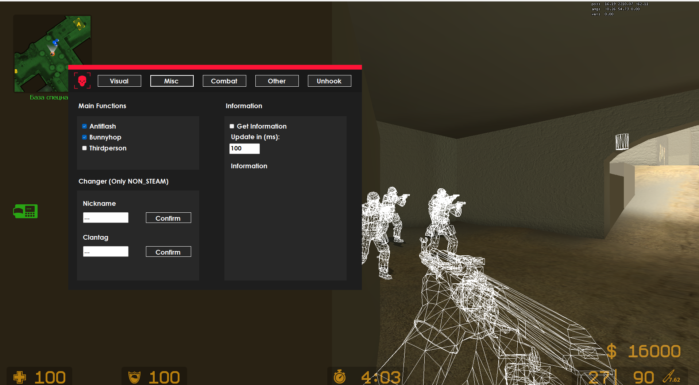
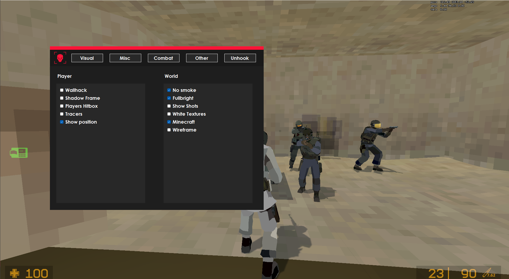
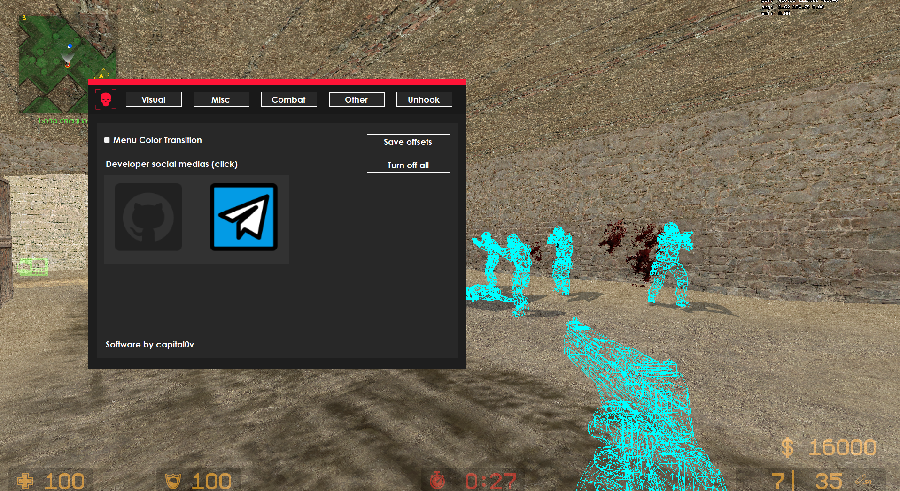

# Vexium 1.5.0

**External cheat for Counter Strike: Source**

## Disclaimer

    <strong>If you get caught cheating on VAC protected servers or competitive leagues, that is your responsibility, not mine. I am not responsible for your actions. The code is published for educational purposes only.</strong>

## What's new?
- Added checks to see if a player is in chat or paused
- Wireframe functions
- "Contacts" changed to "Other"
- Opportunity to get offsets  in "Other" panel
- Code optimization

## Images 

## Installation

Follow the steps below to set up the project:

1. **Clone the Repository**  
   Download the repository to your local machine.

2. **Download the DLL**  
   Obtain the x86 version of [`Memory Raider x86.dll`](https://github.com/capital0v/MemoryRaider/releases/tag/1.3.0).

3. **Set Up Your Environment**  
   Open the project in Visual Studio and configure it for debugging.

4. **Organize Your Files**  
   Place the `Sounds` folder and the `Memory Raider x86.dll` file into the debug folder of your project.

## License
[MIT](https://github.com/capital0v/Vexium-Counter-Strike-Source/blob/main/LICENSE)